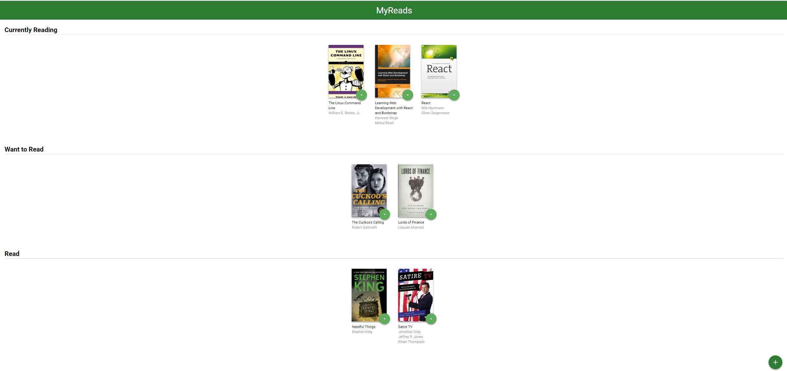
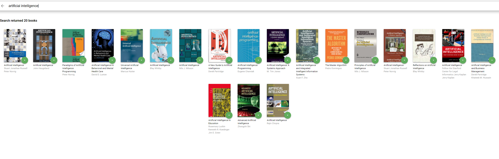

# BookRead APP
---

## Project Purpose:

The purpose of the project is to demonstrate understanding of the basic structure and operation of a React-based app.

##How to load the app

The project uses Node.js and the Create-React-App starter.  If you do not have Node >= 6.x installed, you can download it here: [Node.js](https://nodejs.org/en/)

Once Node is installed, navigate to the directory where you want to store the app

```
git clone https://github.com/abhi29986/React-BookRead-App.git
npm install
```
Once all of the dependencies have been installed you can launch the app with
```
npm start
```
A new browser window should automatically open displaying the app.


## How to Use the App
* Books are sorted into three categories: Currently Reading, Want to Read and Read
* To change a book's category or remove a book from the list, click on the green button on  the book cover


* To search and add new books, click on the green + button at the bottom of the page.
Enter an author's name or subject. Up to 20 items will be returned.

*Note: The backend API is limited to a fixed set of [search terms](#search-terms)  -- see below for valid search options*



### Udacity Resources:
* [Project starter template](https://github.com/udacity/reactnd-project-myreads-starter)
* [Project Rubric](https://review.udacity.com/#!/rubrics/918/view)
* [Udacity CSS Style Guide](http://udacity.github.io/frontend-nanodegree-styleguide/css.html)
* [Udacity HTML Style Guide](http://udacity.github.io/frontend-nanodegree-styleguide/index.html)
* [Udacity JavaScript Style Guide](http://udacity.github.io/frontend-nanodegree-styleguide/javascript.html)


#### Search Terms
'Android', 'Art', 'Artificial Intelligence', 'Astronomy', 'Austen', 'Baseball', 'Basketball', 'Bhagat', 'Biography', 'Brief', 'Business', 'Camus', 'Cervantes', 'Christie', 'Classics', 'Comics', 'Cook', 'Cricket', 'Cycling', 'Desai', 'Design', 'Development', 'Digital Marketing', 'Drama', 'Drawing', 'Dumas', 'Education', 'Everything', 'Fantasy', 'Film', 'Finance', 'First', 'Fitness', 'Football', 'Future', 'Games', 'Gandhi', 'History', 'History', 'Homer', 'Horror', 'Hugo', 'Ibsen', 'Journey', 'Kafka', 'King', 'Lahiri', 'Larsson', 'Learn', 'Literary Fiction', 'Make', 'Manage', 'Marquez', 'Money', 'Mystery', 'Negotiate', 'Painting', 'Philosophy', 'Photography', 'Poetry', 'Production', 'Program Javascript', 'Programming', 'React', 'Redux', 'River', 'Robotics', 'Rowling', 'Satire', 'Science Fiction', 'Shakespeare', 'Singh', 'Swimming', 'Tale', 'Thrun', 'Time', 'Tolstoy', 'Travel', 'Ultimate', 'Virtual Reality', 'Web Development', 'iOS'
